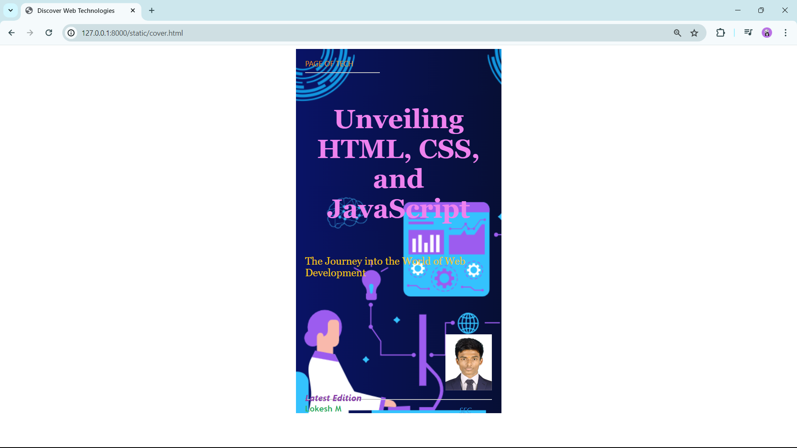

# Ex.06 Book Front Cover Page Design
## Date:22.04.2024

## AIM:
To design a book front cover page using HTML and CSS.

## DESIGN STEPS:

### Step 1:
Create a Django Admin project.

### Step 2:
Create an app in the Django interface.

### Step 3:
Create a folder named 'static' in the app folder.

### Step 4:
Create a new HTML file in the static folder.

### Step 5:
Write the HTML code with relevant CSS properties.

### Step 6:
Choose the appropriate style and color scheme.

### Step 7:
Insert the images in their appropriate places.

### Step 8:
Publish the website in the LocalHost.

## PROGRAM:
```
<html>
    <head>
        <meta name="viewport" content="width=device-width, initial-scale=1.0">
        <style>
            .bookpage{
                width: 400px;
                height: 740px;
                color: #2c3e50; /* Dark blue */
                margin-left: auto;
                margin-right: auto;
                padding: 20px;
                font-family: 'Segoe UI', Tahoma, Geneva, Verdana, sans-serif;
                background-image: url(image.png);
                background-size: cover;
            }
            .insight{
                color: #f39c12; /* Orange */
            }
            .hrstyle{
                width: 160px;
            }
            .author{
                display: inline;
                position: relative;
                color: #27ae60; /* Green */
                top: 200px;
                font-family: 'Trebuchet MS', 'Lucida Sans Unicode', 'Lucida Grande', 'Lucida Sans', Arial, sans-serif;
                font-size: 18px;
            }
            .booktitle{
                color:violet;
                font-family:Georgia, 'Times New Roman', Times, serif;
                font-size: 28px;
                text-align: center;
                position: relative;
                top: 30px;
            }
            .id{
                width: 400px;
                position: relative;
                top: 210px;
            }
            .pub{
                font-size: medium;
                position: relative;
                font-style: oblique;
                top: 165px;
                left: 330px;
                color: #3498db; /* Blue */
            }
            .ed{
                color: #8e44ad; /* Purple */
                font-size: 19px;
                font-style: italic;
                position: relative;
                top: 115px;
            }
            .subtitle{
                color:#f1c40f;
                font-family:Georgia, 'Times New Roman', Times, serif, cursive;
                font-size: 22px;
                position: relative;
                top: 60px;
                text-align:left;
            }
            .mypic{
                position: relative;
                top: 180px;
                left: 300px;
                width: 100px;
                height: 100px;
                background-size: cover;
            }
        </style>
        <title>Discover Web Technologies</title>

    </head>
    <body>
        <div class="bookpage">
            <div class="insight">
                PAGE OF TECH
            </div>
            <div class="hrstyle">
                <hr style="color: #f1c40f;"> <!-- Yellow -->
            </div>
            <div class="booktitle">
                <h1>Unveiling HTML, CSS, and JavaScript</h1>
            </div>
            <div class="subtitle">
                The Journey into the World of Web Development
            </div>
            <div class="mypic">
                
            </div>
            <div class="id">
                <hr style="color: #e67e22;"> <!-- Orange -->
            </div>
            <div class="author">
                <p><b>Lokesh M</b></p>
            </div>
            <div class="pub">
                SEC
            </div>
            <div class="ed">
                <b>Latest Edition</b>
            </div>
        </div>

    </body>
</html>
```

## OUTPUT:


## RESULT:
The program for designing book front cover page using HTML and CSS is completed successfully.
